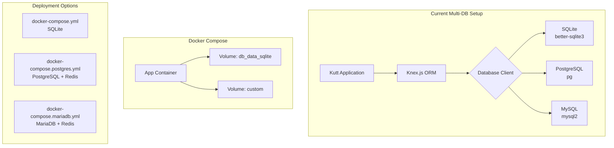
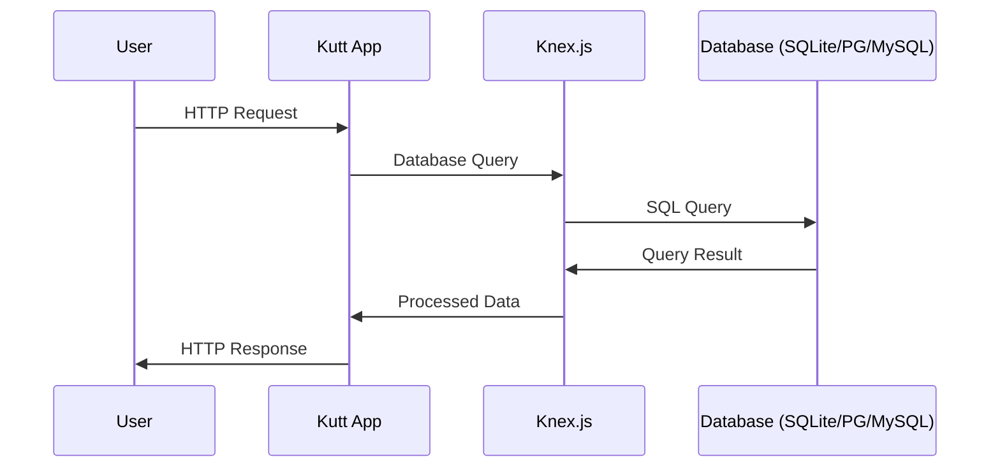
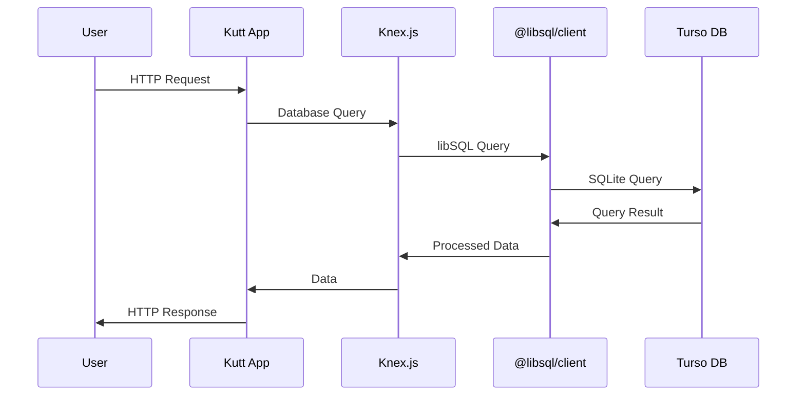
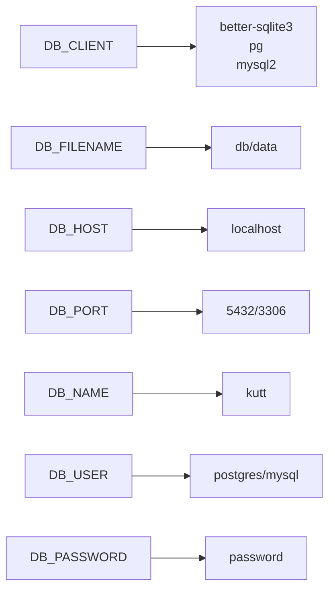
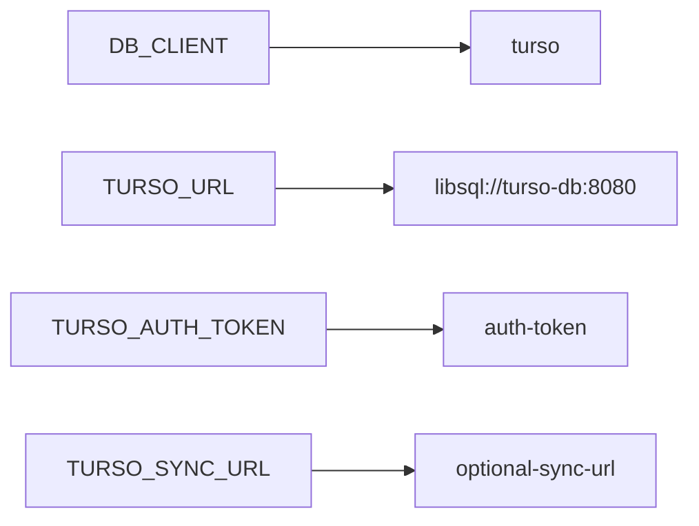
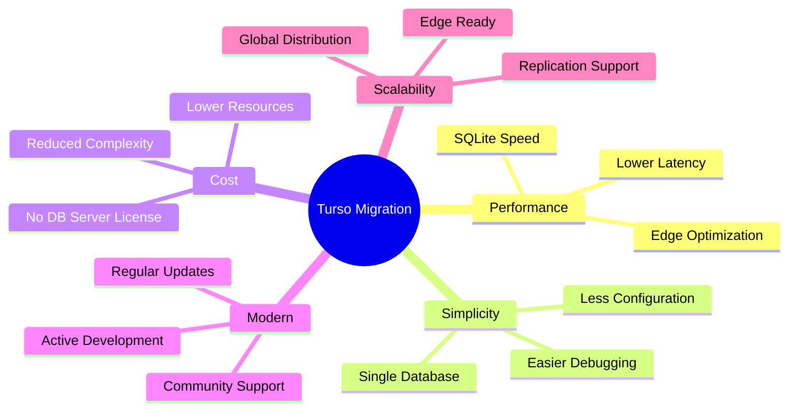
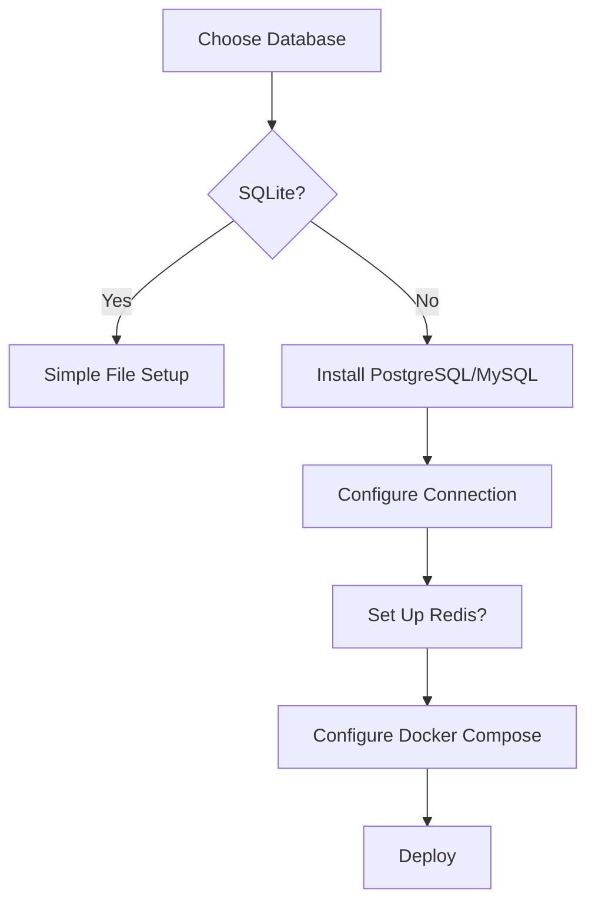

# Kutt to Turso Architecture Diagram

## Current Architecture



## Target Architecture with Turso

```mermaid
graph TB
    subgraph "New Turso-Based Setup"
        A[Kutt Application] --> B[Knex.js ORM]
        B --> C[@libsql/client]
        C --> D[Turso Database<br/>SQLite-compatible]
    end
    
    subgraph "Docker Compose"
        E[App Container] --> F[Volume: custom]
        G[Turso Container] --> H[Volume: turso_data]
        E --> I[Turso Network Connection]
    end
    
    subgraph "Simplified Deployment"
        J[docker-compose.yml<br/>Turso (Default)]
        K[docker-compose.turso.yml<br/>Turso + Custom Config]
    end
```

## Migration Flow

```mermaid
graph LR
    subgraph "Phase 1: Preparation"
        A[Current Setup] --> B[Backup Data]
        B --> C[Install Dependencies]
    end
    
    subgraph "Phase 2: Configuration"
        C --> D[Update Environment]
        D --> E[Modify Database Logic]
        E --> F[Update Docker Config]
    end
    
    subgraph "Phase 3: Migration"
        F --> G[Deploy Turso]
        G --> H[Migrate Data]
        H --> I[Validate Migration]
    end
    
    subgraph "Phase 4: Cleanup"
        I --> J[Remove Old DB Logic]
        J --> K[Update Documentation]
        K --> L[Final Testing]
    end
```



## Container Architecture

```mermaid
graph TB
    subgraph "Docker Network: kutt-network"
        subgraph "kutt-server"
            A1[Node.js App]
            A2[Knex.js]
            A3[@libsql/client]
            A4[Express.js]
            A1 --> A2
            A2 --> A3
            A1 --> A4
        end
        
        subgraph "kutt-turso"
            B1[Turso Server]
            B2[SQLite Engine]
            B3[Data Files]
            B1 --> B2
            B2 --> B3
        end
        
        subgraph "Volumes"
            C1[turso_data<br/>Persistent Storage]
            C2[custom<br/>Custom Files]
        end
    end
    
    A3 -->|libsql://turso-db:8080| B1
    B3 --> C1
    A4 --> C2
    
    D[External User] -->|Port 3000| A4
```

## Data Flow Comparison

### Current Multi-DB Data Flow


### New Turso Data Flow


## Environment Variables Mapping

### Current Environment


### New Turso Environment


## Migration Benefits



## Deployment Comparison

### Current Deployment Complexity


### New Turso Deployment
```mermaid
graph TD
    A[Run docker-compose up] --> B[Turso Container Starts]
    B --> C[App Container Starts]
    C --> D[Connects to Turso]
    D --> E[Ready to Use]